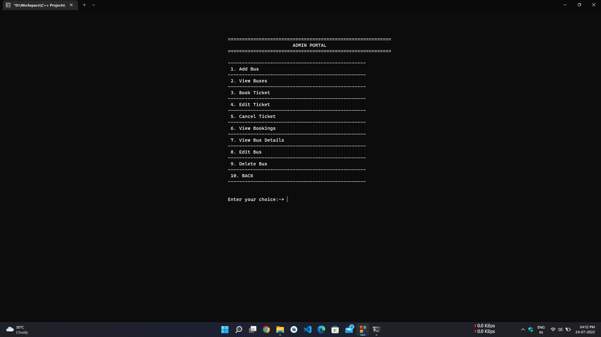

# Bus Reservation System Management

Bus Reservation System Management Project based on `Object Oriented Programming` and `File Handling` Concept in C++.

## Usage

* Get the latest version of Mingw-w64 via MSYS2, which provides up-to-date native builds of GCC, Mingw-w64, and other helpful C++ tools and libraries. [Click here](https://github.com/msys2/msys2-installer/releases/download/2022-06-03/msys2-x86_64-20220603.exe) to download the MSYS2 installer. Then follow the instructions on the MSYS2 website to install Mingw-w64.

* Navigate to `src` folder

```bash
cd src
```

* Run command

```bash
g++ -o main main.cpp
```

* Run `main.exe` file in `src` folder

### Admin Credentials

Username : `admin`
Password : `pass`

## Screenshots

### Welcome Screen


### Main Menu


### User Menu


### Book Ticket


### Admin Menu



### Bus List


